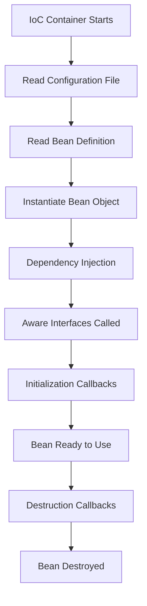

# Bean Life Cycle Demo using Spring Boot

This project demonstrates the complete **Spring Bean Lifecycle** in a Spring Boot application. It explains how the Spring IoC Container creates, initializes, manages, and destroys a bean.

---

## Project Objective

The objective of this project is to understand the lifecycle of a Spring Bean from its creation until its destruction.

---

## Bean Lifecycle Flow

1. IoC Container Starts
2. Reads Configuration File
3. Reads Bean Definition
4. Instantiates Bean Object
5. Injects Dependencies
6. Calls Aware Interfaces
7. Executes Initialization Callbacks
8. Bean is Ready to Use
9. Executes Destruction Callbacks
10. Bean is Destroyed

---

## Spring Bean Lifecycle Diagram
## 🌱 Spring Bean Lifecycle Diagram


## 🌱 Spring Bean Lifecycle Diagram

```text
+-------------------------+
| IoC Container Starts    |
+-------------------------+
            |
            v
+-------------------------+
| Read Configuration File |
+-------------------------+
            |
            v
+-------------------------+
| Read Bean Definition    |
+-------------------------+
            |
            v
+-------------------------+
| Instantiate Bean Object |
+-------------------------+
            |
            v
+-------------------------+
| Dependency Injection    |
+-------------------------+
            |
            v
+-------------------------+
| Aware Interfaces Called |
+-------------------------+
            |
            v
+-------------------------+
| Initialization Callback |
+-------------------------+
            |
            v
+-------------------------+
| Bean Ready to Use       |
+-------------------------+
            |
            v
+-------------------------+
| Destruction Callback    |
+-------------------------+
            |
            v
+-------------------------+
| Bean Destroyed          |
+-------------------------+
```
---

## Technologies Used

- Java 17
- Spring Boot 3.x
- Maven
- Spring Core (IoC Container)

---

## 📂 Project Structure

```text
BeanLifeCycleDemo
│── .mvn/
│── src/
│   ├── main/
│   │   ├── java/
│   │   │   └── org.example/
│   │   │       ├── A.java
│   │   │       ├── B.java
│   │   │       ├── AppConfig.java
│   │   │       ├── CartService.java
│   │   │       ├── Main.java
│   │   │       ├── OrderService.java
│   │   │       ├── PaymentService.java
│   │   │       ├── UserService.java
│   │   │       └── README.md
│   │   └── resources/
│   │
│   └── test/
│
├── target/
├── .gitignore
├── pom.xml
└── README.md
```
### 📁 Package Description

| File | Description |
|------|-------------|
| `AppConfig.java` | Spring Configuration class containing bean definitions. |
| `A.java` | Demonstrates dependency injection with Bean A. |
| `B.java` | Supporting bean used in the lifecycle demonstration. |
| `UserService.java` | Service bean representing user operations. |
| `PaymentService.java` | Service bean for payment-related functionality. |
| `OrderService.java` | Service bean for order processing. |
| `CartService.java` | Service bean for cart operations. |
| `Main.java` | Entry point that loads the Spring IoC Container and demonstrates the bean lifecycle. |

---

## Lifecycle Methods Used

### Constructor
Called when the bean object is created.

### Dependency Injection
Spring injects required dependencies.

### InitializingBean / @PostConstruct
Executed after dependency injection.

### Bean Ready
Bean is available for use inside the application.

### DisposableBean / @PreDestroy
Executed before the bean is removed from the container.

---

## How to Run

1. Clone the repository

2. Open the project in IntelliJ IDEA or Eclipse.

3. Run

4. Observe the console output to understand each lifecycle stage.

---


## Learning Outcomes

- Understand Spring IoC Container
- Learn Bean Creation Process
- Understand Dependency Injection
- Learn Bean Initialization
- Learn Bean Destruction
- Understand Spring Bean Lifecycle

---

