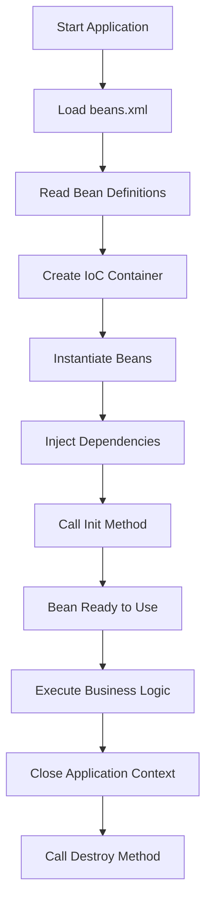

# Spring XML-Based Configuration

A beginner-friendly Spring Framework project demonstrating **XML-Based Configuration**, Bean Creation, Dependency Injection, Bean Scopes, Autowiring, Lifecycle Methods, and Collection Injection.

---

## 📖 Overview

Before annotations became popular, Spring applications were configured using XML files. XML provides configuration metadata that tells the Spring IoC Container:

- Which classes should become beans
- Bean names (id/name)
- Bean scope (Singleton/Prototype)
- Dependencies between beans
- Bean lifecycle methods
- Autowiring mode

Spring converts this XML configuration into **BeanDefinition** objects and manages the complete lifecycle of every bean.

---

## 🚀 Technologies Used

- Java 17
- Spring Framework
- Maven
- XML Configuration
- IntelliJ IDEA

---

## 📂 Project Structure

```text
SpringXMLConfiguration
│
├── src
│   ├── main
│   │   ├── java
│   │   │   └── org.example
│   │   │       ├── Main.java
│   │   │       ├── PaymentService.java
│   │   │       ├── OrderService.java
│   │   │       ├── UserService.java
│   │   │       └── ...
│   │   │
│   │   └── resources
│   │       └── beans.xml
│   │
│   └── test
│
├── pom.xml
├── .gitignore
└── README.md
```

---

# Spring XML Configuration Flow



---

## 📚 Topics Covered

### 1. XML Configuration

- beans.xml
- `<bean>`
- `id`
- `class`

---

### 2. Bean Creation

```xml
<bean id="paymentService"
      class="org.example.PaymentService"/>
```

---

### 3. Dependency Injection

#### Constructor Injection

```xml
<constructor-arg ref="paymentService"/>
```

#### Setter Injection

```xml
<property
    name="paymentService"
    ref="paymentService"/>
```

---

### 4. Bean Naming

- id
- name
- alias

---

### 5. Bean Scope

- Singleton
- Prototype

---

### 6. XML Autowiring

- byName
- byType
- constructor

---

### 7. Bean Lifecycle

- Constructor
- init-method
- destroy-method

Example:

```xml
<bean id="paymentService"
      class="org.example.PaymentService"
      init-method="init"
      destroy-method="cleanup"/>
```

---

### 8. Collection Injection

- List
- Set
- Map

---

### 9. Multiple XML Files

Using

```xml
<import resource="orderContext.xml"/>
```

---

### 10. XML + Annotation Configuration

```xml
<context:component-scan
base-package="org.example"/>
```

---

## ▶️ How to Run

1. Clone the repository

```bash
git clone https://github.com/jyoti445gh/spring-boot-practice.git
```

2. Open the project in IntelliJ IDEA.

3. Build the project using Maven.

4. Run

```text
Main.java
```

---

## Expected Output

```text
PaymentService object created

OrderService object created

Payment successful

Order placed

PaymentService cleanup method called
```

---

## 🎯 Learning Outcomes

After completing this project, you will understand:

- Spring IoC Container
- XML-Based Configuration
- Bean Definition
- Dependency Injection
- Constructor Injection
- Setter Injection
- Bean Naming
- Bean Scope
- XML Autowiring
- Bean Lifecycle
- Collection Injection
- Splitting XML Configuration
- XML and Annotation Integration

---

## 📚 References

- Spring Framework Documentation
- Spring XML-Based Configuration Notes

---


